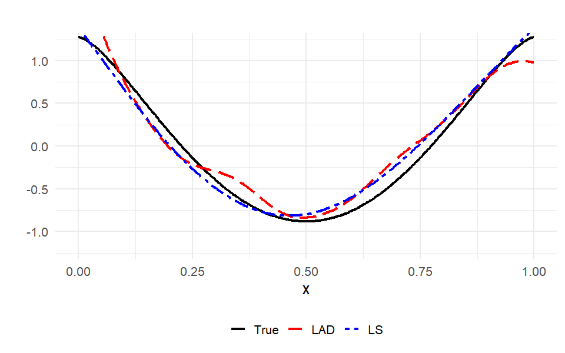
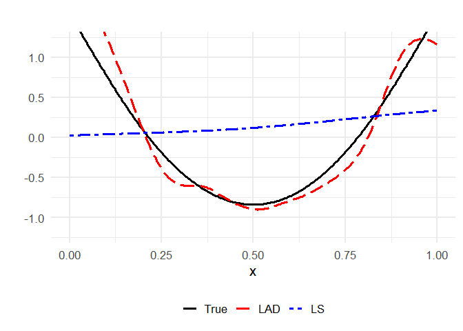
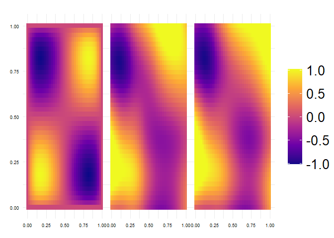
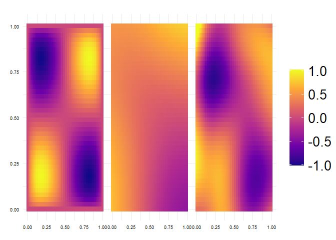

Generalized nonparametric regression in reproducing kernel Hilbert
spaces
================

## Download and source the functions

This repository contains fast `C++` implementations with an `R`
interface of the reproducing kernel Hilbert space estimators of
Kalogridis (2026).

The computation is done with **Iteratively Reweighted Least-Squares**
and the penalty parameter is selected with **robust Generalized Cross
Validation**.

Here are detailed installation instructions:

1.  Clone or download this repository and set your `R` working directory
    to the repository folder.

``` r
getwd()
```

2.  Load the `R` function `rkhs.R` (Quantile and Least-squares RKHS
    estimators).

``` r
source("rkhs.R")    # Quantile and LS estimators
```

3.  Be sure to have installed and loaded the `R`-packages `Rcpp` and
    `RcppArmadillo`:

``` r
# install.packages(c("Rcpp", "RcppArmadillo"))
library(Rcpp); library(RcppArmadillo)
```

4.  The `R`-functions will automatically compile and source the `C++`
    implementations in `rkhs_quan.cpp`.

5.  A typical usage block is

``` r
fit <- fit_rkhs(
    X, y,
    loss = "quantile",
    tau = 0.5,
    kernel = "matern"
)

pred <- predict_rkhs(fit, X, Xnew)
```

where $X$ is an $n \times d$ matrix of predictors and
$y \in \mathbb{R}^n$. `loss` specifies the loss function to be used -
quantile or ls. `tau` is the quantile to be estimated - only useful for
the quantile loss. Currently supported kernels are (i) matern (ii)
Gaussian and (iii) tensor (product kernel). All kernels can be used for
both one-dimensional and multi-dimensional predictors, see the paper for
detailed explanations.

## Example 1: One-dimensional data

``` r
set.seed(11)

n    <- 300 # 
beta <- 0.75 # one of c(0.5, 0.75, 1.0) 
p <- 1.2

K <- 50
k <- 1:K

coeff <- k^(-(2 * beta + p))

f0 <- function(X) {
  X <- as.matrix(X)
  out <- rep(0, nrow(X))
  for (j in 1:K) {
    out <- out + coeff[j] * cos(2 * pi * j * X[,1])
  }
  return(out)}

X <- matrix(runif(n), n, 1)

# Targets
Xg <-  seq(0, 1, length = 300)
f0g <- f0(Xg)

y <- f0(X) + rnorm(n)

fit_ls <- fit_rkhs(
  X, y, loss = "ls",
  kernel = "matern")

fit_q <- fit_rkhs(
  X, y, loss = "quantile", tau = 0.5,
  kernel = "matern")

f_ls <- predict_rkhs(fit_ls, X, Xg)
f_q  <- predict_rkhs(fit_q,  X, Xg)
```

``` r
library(ggplot2)

df <- data.frame(
  t = rep(Xg, 3),
  value = c(f0g, f_q, f_ls),
  method = factor(rep(c("True","LAD", "LS"), each=length(Xg)),
                  levels = c("True", "LAD", "LS")))

colors <- c("True" = "black", "LAD" = "red", "LS" = "blue")
line_types <- c("True" = "solid", "LAD" = "longdash", "LS" = "twodash")

ggplot(df, aes(x=t, y=value, color=method, linetype=method)) +
  geom_line(size=1.2) +
  theme_minimal(base_size = 16) +
  labs(x="x", y="", title="") + coord_cartesian(ylim=c(-1.2,1.2)) + 
  scale_color_manual(values = colors) +
  scale_linetype_manual(values = line_types) + 
  theme(legend.title = element_blank(),
        legend.position = "bottom",
        plot.title = element_text(hjust = 0.5))
```

<!-- -->

If the measurement errors follow a light-tailed distribution, the
estimators perform comparably.

But for heavy tailed errors the situation changes dramatically in favour
of the robust quantile estimator:

``` r
set.seed(11)

y <- f0(X) + rt(n, df = 2)

fit_ls <- fit_rkhs(
  X, y, loss = "ls",
  kernel = "matern")

fit_q <- fit_rkhs(
  X, y, loss = "quantile", tau = 0.5,
  kernel = "matern")

f_ls <- predict_rkhs(fit_ls, X, Xg)
f_q  <- predict_rkhs(fit_q,  X, Xg)

df <- data.frame(
  t = rep(Xg, 3),
  value = c(f0g, f_q, f_ls),
  method = factor(rep(c("True","LAD", "LS"), each=length(Xg)),
                  levels = c("True", "LAD", "LS")))

colors <- c("True" = "black", "LAD" = "red", "LS" = "blue")
line_types <- c("True" = "solid", "LAD" = "longdash", "LS" = "twodash")

ggplot(df, aes(x=t, y=value, color=method, linetype=method)) +
  geom_line(size=1.2) +
  theme_minimal(base_size = 16) +
  labs(x="x", y="", title="") + coord_cartesian(ylim=c(-1.2,1.2)) + 
  scale_color_manual(values = colors) +
  scale_linetype_manual(values = line_types) + 
  theme(legend.title = element_blank(),
        legend.position = "bottom",
        plot.title = element_text(hjust = 0.5))
```

<!-- -->

## Example 2: Two-dimensional data

Let us now consider a more complex example with two dimensional
predictors $\mathbf{x}_1, \ldots, \mathbf{x}_n \subset [0,1]^2$. The
data are generated according to

$$y_i = \sum_{j=1}^{25} \sum_{k=1}^{25} (j k)^{-(2 \beta + 1.2)} \sin(2 \pi j  x_{i1}) \sin(2 \pi k x_{i2}) + \epsilon_i, \quad (i=1, \ldots, n),$$
for $\beta = 0.75$ and $\epsilon_i$ iid Gaussian or $t_2$.

We compare the true regression surface with the least-squares (LS) and
least-absolute-deviation (LAD) tensor RKHS estimates.

``` r
set.seed(2)

# Setup
n <- 300
beta <- 0.75
K <- 25

X <- matrix(runif(2*n), n, 2)                    

# True function
f0 <- function(X) {
  X <- as.matrix(X)
  out <- 0
  for (j in 1:K) {
    for (k in 1:K) {
      coef <- (j * k)^(-(2 * beta + 1.2))
      out <- out + coef * sin(2*pi*j*X[,1]) * sin(2*pi*k*X[,2])
    }
  }
  out
}

y <- f0(X) + rnorm(n)                       

# Fit models
fit_ls <- fit_rkhs(X, y, loss = "ls", kernel = "tensor")
fit_q  <- fit_rkhs(X, y, loss = "quantile", tau = 0.5, kernel = "tensor")

# Prediction grid
grid <- expand.grid(x1 = seq(0, 1, length = 40),
                    x2 = seq(0, 1, length = 40))

Xg <- as.matrix(grid)
f_true <- f0(Xg)
f_ls   <- as.numeric(predict_rkhs(fit_ls, X, Xg))
f_q    <- as.numeric(predict_rkhs(fit_q,  X, Xg))

df <- rbind(
  data.frame(x1 = grid$x1, x2 = grid$x2, z = f_true, method = "True"),
  data.frame(x1 = grid$x1, x2 = grid$x2, z = f_ls,   method = "LS"),
  data.frame(x1 = grid$x1, x2 = grid$x2, z = f_q,    method = "LAD")
)
df$method <- factor(df$method,
                    levels = c("True", "LS", "LAD"))


# Plot
z_range <- range(f_true)
padding <- 0.05 * diff(z_range)

ggplot(df, aes(x1, x2, fill = z)) +
  geom_tile() +
  facet_wrap(~ method, ncol = 3) +
  scale_fill_viridis_c(option = "C",
                       limits = z_range + c(-padding, padding),
                       oob = scales::squish) +
  coord_fixed() +
  theme_minimal(base_size = 13) +
  labs(x = "", y = "", fill = "f(x)") +
  theme(strip.text = element_text(face = "bold"))
```

<!-- -->

Now let’s see what happens if instead of light-tailed Gaussian we have
heavy-tailed $t_2$ errors.

``` r
set.seed(2)

y <- f0(X) + rt(n, df = 2) 

# fit RKHS estimators 
fit_ls <- fit_rkhs(X, y, loss = "ls", kernel = "tensor") 
fit_q <- fit_rkhs(X, y, loss = "quantile", tau = 0.5, kernel = "tensor") 

f_ls   <- as.numeric(predict_rkhs(fit_ls, X, Xg))
f_q    <- as.numeric(predict_rkhs(fit_q,  X, Xg))

df <- rbind(
  data.frame(x1 = grid$x1, x2 = grid$x2, z = f_true, method = "True"),
  data.frame(x1 = grid$x1, x2 = grid$x2, z = f_ls,   method = "LS"),
  data.frame(x1 = grid$x1, x2 = grid$x2, z = f_q,    method = "LAD")
)

df$method <- factor(df$method,
                    levels = c("True", "LS", "LAD"))

ggplot(df, aes(x1, x2, fill = z)) +
  geom_tile() +
  facet_wrap(~ method, ncol = 3) +
  scale_fill_viridis_c(option = "C", 
                       limits = c(z_range[1] - padding, z_range[2] + padding)) +  
  coord_fixed() +
  theme_minimal(base_size = 13) +
  labs(x = "", y = "", fill = "f(x)") +
  theme(strip.text = element_text(face = "bold"))
```

<!-- -->

## Notes

- See the `R`-functions for complete documentation of the
  settings/options.
- The simulations scripts (for $d=1$ and $d=2$) reproduce the results
  from Section 6 in Kalogridis (2026).

Contact me at <ioannis.kalogridis@glasgow.ac.uk> for any issues,
questions or suggestions.

## References

Kalogridis, I. (2026). Generalized nonparametric regression in
reproducing kernel Hilbert spaces: Consistency and rates of convergence,
under review.
